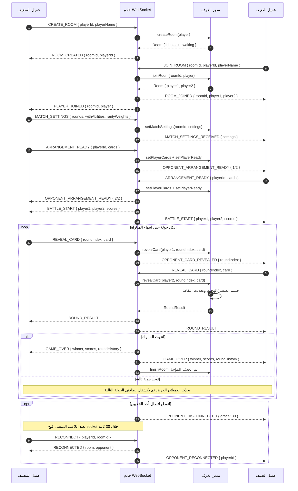

# مخطط تسلسلي — معركة Card Clash الجماعية

يوضح هذا المخطط تدفق البيانات المرجعي بين عميل المضيف وعميل الضيف وخادم WebSocket ومدير الغرف، بدءاً من إنشاء الغرفة وحتى نهاية المباراة أو استعادة الاتصال.

## نقاط التحكم الأساسية

| المرحلة | مسؤولية العميل | مسؤولية الخادم |
|---|---|---|
| الغرفة | حفظ `roomId` و`playerId` محلياً | إنشاء الغرفة، ومنع انضمام لاعب ثالث. |
| الإعدادات | يرسل المضيف إعدادات المباراة فقط | حفظ الإعدادات وتمريرها للضيف. |
| الجاهزية | ترتيب البطاقات ثم إرسال `ARRANGEMENT_READY` مرة واحدة | بدء المعركة بعد جاهزية الطرفين. |
| الجولة | إرسال بطاقة الجولة ثم انتظار النتيجة | حسم الجولة بعد كشف البطاقتين وبث نتيجة واحدة موثوقة. |
| الانقطاع | عرض عداد المهلة وإرسال `RECONNECT` عند عودة الشبكة | الاحتفاظ بالغرفة 30 ثانية ثم إبلاغ الخصم أو حذف الغرفة. |

> يجب أن يعرض العميل نتيجة `ROUND_RESULT` القادمة من الخادم، لا نتيجة محلية مستقلة؛ الخادم هو المرجع للنقاط ولتحديد نهاية المباراة.
