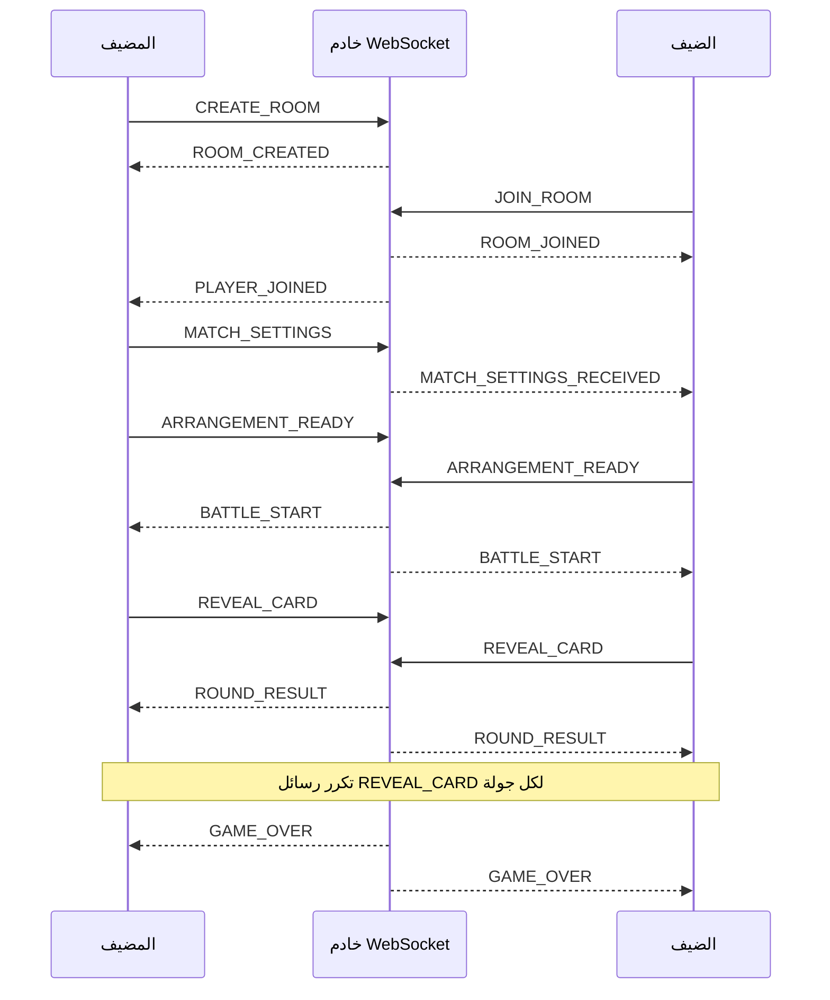

# توثيق API — خادم اللعب الجماعي عبر WebSocket

> **Card Clash Multiplayer API**  
> **النقل:** WebSocket مع رسائل JSON  
> **المسار:** `/multiplayer`  
> **الإصدار:** 1.0 (يعكس التنفيذ الحالي للخادم)

هذا المستند هو المرجع العملي لتكامل عميل جديد مع خادم اللعب الجماعي في Card Clash. يغطي فتح الاتصال، إنشاء الغرف والانضمام إليها، إعداد المباراة، ترتيب البطاقات، مزامنة الجولات، إعادة الاتصال، ورسائل الخطأ والانقطاع.

مصدر الحقيقة للبروتوكول هو الملفات التالية:

| الملف | المسؤولية |
|---|---|
| [`server/index.ts`](../server/index.ts) | تشغيل خادم HTTP وWebSocket المستقل، ونقاط الصحة. |
| [`server/multiplayer/websocket-server.ts`](../server/multiplayer/websocket-server.ts) | توجيه رسائل WebSocket وبث الأحداث للعملاء. |
| [`server/multiplayer/room-manager.ts`](../server/multiplayer/room-manager.ts) | حالة الغرفة، كشف البطاقات، وحسم نتيجة الجولة. |
| [`lib/multiplayer/websocket-client.ts`](../lib/multiplayer/websocket-client.ts) | عميل التطبيق المرجعي. |

---

## المحتويات

- [بدء الخادم والاتصال](#بدء-الخادم-والاتصال)
- [غلاف الرسالة](#غلاف-الرسالة)
- [النماذج المشتركة](#النماذج-المشتركة)
- [دورة حياة الغرفة](#دورة-حياة-الغرفة)
- [رسائل العميل إلى الخادم](#رسائل-العميل-إلى-الخادم)
- [رسائل الخادم إلى العميل](#رسائل-الخادم-إلى-العميل)
- [قواعد حسم الجولة](#قواعد-حسم-الجولة)
- [إعادة الاتصال والانقطاع](#إعادة-الاتصال-والانقطاع)
- [نقاط HTTP المساعدة](#نقاط-http-المساعدة)
- [مثال تكامل JavaScript](#مثال-تكامل-javascript)
- [الأخطاء والقيود الأمنية](#الأخطاء-والقيود-الأمنية)
- [دليل الاختبار](#دليل-الاختبار)

---

## بدء الخادم والاتصال

شغّل خادم اللعب الجماعي من جذر التطبيق:

```bash
pnpm server:multiplayer
```

يستمع الخادم إلى المنفذ الموجود في `MULTIPLAYER_PORT`، أو إلى المنفذ `3001` عند عدم تحديده. يجب أن يتصل العميل بالمسار `/multiplayer`.

```text
ws://HOST:3001/multiplayer
```

### إعداد العميل عبر متغير البيئة

```env
EXPO_PUBLIC_MP_SERVER_URL=ws://192.168.1.10:3001/multiplayer
MULTIPLAYER_PORT=3001
```

> عند التشغيل على هاتف فعلي، لا تستخدم `localhost`؛ استخدم عنوان LAN للجهاز الذي يشغّل الخادم، مثل `192.168.1.10`، ويجب أن يكون الهاتف والخادم على الشبكة نفسها.

### نبضات الاتصال

يرسل الخادم إطار WebSocket `ping` كل **25 ثانية** للاتصالات المفتوحة. يدعم البروتوكول أيضاً رسالة تطبيقية اختيارية باسم `PING`، ويرد عليها الخادم برسالة `PONG` تحتوي على طابع زمني.

---

## غلاف الرسالة

كل رسالة تطبيقية مرسلة أو مستلمة هي كائن JSON بهذا الشكل:

```json
{
  "type": "MESSAGE_TYPE",
  "payload": {}
}
```

| الحقل | النوع | الوصف |
|---|---|---|
| `type` | `string` | اسم الرسالة كما هو موضح في الجداول التالية. الأسماء حساسة لحالة الأحرف. |
| `payload` | `object` | بيانات الرسالة. قد تكون كائناً فارغاً في رسائل مثل `PING`. |

الرسالة غير القابلة للتحويل من JSON ترد برسالة `ERROR` بالنص `Invalid message format`.

---

## النماذج المشتركة

### اللاعب `Player`

```ts
interface Player {
  id: string;
  name: string;
  socketId: string;
  isReady: boolean;
  cards?: Card[];
  rounds?: number;
}
```

| الحقل | ملاحظات |
|---|---|
| `id` | معرف ثابت يولده العميل مرة واحدة ويعيد استخدامه عند إعادة الاتصال. |
| `name` | الاسم المعروض للخصم. |
| `socketId` | يساوي `id` في التنفيذ الحالي. لا يعتمد العميل عليه كمعرف اتصال مستقل. |
| `isReady` | يصبح `true` عند تأكيد ترتيب البطاقات أو إرسال `PLAYER_READY`. |
| `cards` | بطاقات اللاعب المرتبة حسب الجولات. |
| `rounds` | عدد الجولات التي أرسلها اللاعب. |

### البطاقة `Card`

لا يفرض الخادم حالياً مخططاً كاملاً على البطاقة، لكنه يستخدم حقول العنصر والهجوم والدفاع عند حسم الجولة. أرسل بنية البطاقة الكاملة من قاعدة بيانات التطبيق كلما أمكن.

```json
{
  "id": "fire-knight-01",
  "nameAr": "فارس النار",
  "element": "fire",
  "attack": 8,
  "defense": 4,
  "hp": 10,
  "rarity": "rare"
}
```

الحقول المستخدمة فعلياً في حساب النتيجة هي:

| الحقل | النوع | السلوك عند غيابه |
|---|---|---|
| `element` | `string` | تعامل القيمة الناقصة كعنصر بلا أفضلية. |
| `attack` | `number` | تعامل القيمة الناقصة كـ `0`. |
| `defense` | `number` | تعامل القيمة الناقصة كـ `0`. |

### إعدادات المباراة `MatchSettings`

```ts
interface MatchSettings {
  rounds: number;
  withAbilities: boolean;
  rarityWeights: Record<string, number>;
}
```

| الحقل | الوصف |
|---|---|
| `rounds` | عدد الجولات الذي يختاره المضيف. |
| `withAbilities` | يحدد تفعيل القدرات عند تجهيز البطاقات في العميل. |
| `rarityWeights` | أوزان الندرات المستخدمة في اختيار البطاقات، مثل `common` و`rare` و`epic` و`legendary`. |

### نتيجة الجولة `RoundResult`

```ts
interface RoundResult {
  roundIndex: number;
  p1Card: Card;
  p2Card: Card;
  winner: 'player1' | 'player2' | 'draw';
  p1Score: number;
  p2Score: number;
  advantage: 'element' | 'attack' | 'draw';
}
```

---

## دورة حياة الغرفة



### حالات الغرفة

| الحالة | المعنى |
|---|---|
| `waiting` | أنشئت الغرفة أو بقي فيها لاعب واحد. تقبل ضيفاً جديداً. |
| `playing` | انضم اللاعب الثاني وبدأت جلسة الغرفة. تبدأ المعركة فعلياً عند اكتمال الترتيب والجاهزية. |
| `finished` | انتهت المباراة. يحذف الخادم الغرفة بعد 60 ثانية من بث `GAME_OVER`، وقد ينظفها التنظيف الدوري أيضاً. |

تنتهي الغرفة غير النشطة بعد **30 دقيقة** من إنشائها. يجري الخادم تنظيفاً دورياً كل خمس دقائق.

---

## رسائل العميل إلى الخادم

### 1. `CREATE_ROOM`

ينشئ لاعب مضيف وغرفة جديدة بمعرف من ستة أحرف/أرقام.

```json
{
  "type": "CREATE_ROOM",
  "payload": {
    "playerId": "player_abc123",
    "playerName": "Fahad"
  }
}
```

| الحقل | مطلوب | الوصف |
|---|---:|---|
| `playerId` | نعم | معرف العميل الثابت. |
| `playerName` | نعم | اسم اللاعب المعروض. |

**الردود المحتملة:** `ROOM_CREATED` للمضيف.

---

### 2. `JOIN_ROOM`

ينضم لاعب ثانٍ إلى غرفة قائمة. لا تقبل الغرفة أكثر من لاعبين.

```json
{
  "type": "JOIN_ROOM",
  "payload": {
    "roomId": "AB12CD",
    "playerId": "player_xyz789",
    "playerName": "Noura"
  }
}
```

**الردود المحتملة:**

| المتلقي | الرسالة |
|---|---|
| الضيف | `ROOM_JOINED` مع بيانات اللاعبَين. |
| المضيف | `PLAYER_JOINED` مع بيانات الضيف. |
| العميل الطالب عند الفشل | `ERROR` بالنص `Room not found or full`. |

---

### 3. `RECONNECT`

يستعيد اللاعب الاتصال بغرفة قائمة خلال مهلة الانقطاع. احتفظ بـ `playerId` و`roomId` محلياً حتى نهاية المباراة.

```json
{
  "type": "RECONNECT",
  "payload": {
    "playerId": "player_abc123",
    "roomId": "AB12CD"
  }
}
```

**الردود المحتملة:** `RECONNECTED` للمتصل من جديد و`OPPONENT_RECONNECTED` للخصم. إذا لم تعد الغرفة موجودة، يستقبل العميل `ERROR` بالنص `Room expired or not found`.

---

### 4. `LEAVE_ROOM`

يخرج اللاعب من الغرفة طوعاً.

```json
{
  "type": "LEAVE_ROOM",
  "payload": {
    "playerId": "player_abc123"
  }
}
```

يتلقى اللاعب الباقي `PLAYER_LEFT`. إذا لم يبق أي لاعب، يحذف الخادم الغرفة.

---

### 5. `MATCH_SETTINGS`

يرسلها المضيف بعد اختيار إعدادات المباراة. يحفظها الخادم ثم يرسلها إلى اللاعب الآخر.

```json
{
  "type": "MATCH_SETTINGS",
  "payload": {
    "playerId": "player_abc123",
    "rounds": 5,
    "withAbilities": true,
    "rarityWeights": {
      "common": 50,
      "rare": 30,
      "epic": 15,
      "legendary": 5
    }
  }
}
```

**الردود المحتملة:** `MATCH_SETTINGS_RECEIVED` للضيف.

> يعتمد الخادم في هذه النسخة على قيام واجهة المضيف فقط بإرسال الرسالة. يجب أن يتبع العميل هذه القاعدة حتى لو لم يرفض الخادم رسالة اللاعب الثاني صراحةً.

---

### المطابقة التنافسية `QUEUE_MATCHMAKING`

يضيف اللاعب إلى طابور مباراة تنافسية. يبدأ الخادم بفرق ترتيب أقصاه `100` نقطة ELO، ثم يزيد المدى `50` نقطة كل عشر ثوانٍ للاعب المنتظر، حتى حد أقصى قدره `400` نقطة. عند وجود عدة خصوم مناسبين، يختار الخادم أقرب ترتيب أولاً.

```json
{
  "type": "QUEUE_MATCHMAKING",
  "payload": {
    "playerId": "player_abc123",
    "playerName": "Fahad",
    "rating": 1200
  }
}
```

| الرد | الوصف |
|---|---|
| `MATCHMAKING_QUEUED` | يحتوي على `tier` و`position` و`searchRange` الحاليين. |
| `MATCH_FOUND` | يحتوي على `roomId` واللاعبين وفرق الترتيب، وينشئ غرفة تنافسية جاهزة لتجهيز البطاقات. |
| `ERROR` | يظهر إن كان اللاعب داخل غرفة قائمة أو أرسل بيانات لاعب ناقصة. |

### إلغاء المطابقة `CANCEL_MATCHMAKING`

```json
{
  "type": "CANCEL_MATCHMAKING",
  "payload": { "playerId": "player_abc123" }
}
```

يرد الخادم برسالة `MATCHMAKING_CANCELLED` مع الحقل `removed` الذي يبين ما إذا كان اللاعب موجوداً في الطابور عند تنفيذ الإلغاء.

---

### 6. `SET_CARDS`

يرسل مجموعة بطاقات اللاعب وعدد الجولات. تستخدمه الواجهات التي تفصل اختيار البطاقات عن تأكيد بدء المعركة.

```json
{
  "type": "SET_CARDS",
  "payload": {
    "playerId": "player_abc123",
    "rounds": 5,
    "cards": [
      { "id": "fire-knight-01", "element": "fire", "attack": 8, "defense": 4 },
      { "id": "water-mage-02", "element": "water", "attack": 7, "defense": 5 }
    ]
  }
}
```

**الردود المحتملة:** `OPPONENT_CARDS_SET` للخصم، وتحتوي على `rounds` فقط حتى لا تُكشف بطاقات اللاعب قبل وقتها.

---

### 7. `PLAYER_READY`

يثبت جاهزية اللاعب بعد ترتيب بطاقاته. عند جاهزية الطرفين، يبث الخادم `BATTLE_START`.

```json
{
  "type": "PLAYER_READY",
  "payload": {
    "playerId": "player_abc123",
    "isReady": true
  }
}
```

**الردود المحتملة:** `OPPONENT_READY` للخصم، ثم `BATTLE_START` للطرفين عند اكتمال الجاهزية.

---

### 8. `ARRANGEMENT_READY`

هذه هي الرسالة الموصى بها في تدفق الواجهة الحالي؛ تحفظ البطاقات وتعلن الجاهزية في رسالة واحدة. يبدأ الخادم المباراة فقط بعد أن يرسلها اللاعبان.

```json
{
  "type": "ARRANGEMENT_READY",
  "payload": {
    "playerId": "player_abc123",
    "cards": [
      { "id": "fire-knight-01", "element": "fire", "attack": 8, "defense": 4 },
      { "id": "water-mage-02", "element": "water", "attack": 7, "defense": 5 }
    ]
  }
}
```

**الردود المحتملة:** `OPPONENT_ARRANGEMENT_READY` للخصم، ثم `BATTLE_START` للطرفين عند اكتمال عدد اللاعبين الجاهزين.

---

### 9. `REVEAL_CARD`

يكشف اللاعب بطاقته في الجولة الحالية. لا يعلن الخادم النتيجة حتى يكشف اللاعبان بطاقتيهما.

```json
{
  "type": "REVEAL_CARD",
  "payload": {
    "playerId": "player_abc123",
    "roundIndex": 0,
    "card": {
      "id": "fire-knight-01",
      "element": "fire",
      "attack": 8,
      "defense": 4
    }
  }
}
```

**الردود المحتملة:**

| التوقيت | الرسالة |
|---|---|
| بعد الكشف الأول | `OPPONENT_CARD_REVEALED` للطرف الآخر مع `roundIndex` فقط. |
| بعد الكشف الثاني | `ROUND_RESULT` للطرفين. |
| عند نهاية المباراة | `GAME_OVER` للطرفين بعد `ROUND_RESULT` الأخير. |

---

### 10. `PING`

رسالة اختيارية لقياس نبض التطبيق أو زمن الرحلة.

```json
{ "type": "PING", "payload": {} }
```

**الرد:** `PONG` مع الحقل `ts`، وهو طابع زمني للخادم بالمللي ثانية.

---

## رسائل الخادم إلى العميل

| الرسالة | المتلقي | الحقول الأساسية | الوصف |
|---|---|---|---|
| `ROOM_CREATED` | المضيف | `roomId`, `playerId` | تأكيد إنشاء الغرفة. |
| `ROOM_JOINED` | الضيف | `roomId`, `player1`, `player2` | تأكيد انضمام اللاعب الثاني. |
| `PLAYER_JOINED` | المضيف | `roomId`, `player` | إعلام بأن الضيف انضم. |
| `MATCH_SETTINGS_RECEIVED` | الضيف | `rounds`, `withAbilities`, `rarityWeights` | إعدادات أرسلها المضيف. |
| `OPPONENT_CARDS_SET` | الخصم | `rounds` | أكد اختيار البطاقات دون كشفها. |
| `OPPONENT_READY` | الخصم | `isReady` | تبدلت حالة جاهزية الخصم. |
| `OPPONENT_ARRANGEMENT_READY` | الخصم | `readyCount`, `totalPlayers` | تقدم ترتيب الفريق في الغرفة. |
| `BATTLE_START` | اللاعبان | `player1`, `player2`, `totalRounds`, `p1Score`, `p2Score` | يبدأ المعركة بعد الجاهزية. |
| `OPPONENT_CARD_REVEALED` | الخصم | `roundIndex` | كشف الخصم بطاقة، دون بيانات البطاقة. |
| `ROUND_RESULT` | اللاعبان | `RoundResult` | نتيجة الجولة الموثوقة من الخادم. |
| `GAME_OVER` | اللاعبان | `winner`, `p1Score`, `p2Score`, `roundHistory` | النتيجة النهائية للمباراة. |
| `RECONNECTED` | اللاعب المعاد اتصاله | `room`, `opponent` | لقطة لاستعادة واجهة المباراة. |
| `OPPONENT_RECONNECTED` | الخصم | `playerId` | عاد الخصم إلى الجلسة. |
| `OPPONENT_DISCONNECTED` | الخصم | `playerId`, `grace` | انقطع الخصم، و`grace` بالثواني. |
| `OPPONENT_LEFT_PERMANENTLY` | الخصم | `playerId` | لم يعد الخصم خلال المهلة وحُذفت الغرفة. |
| `PLAYER_LEFT` | اللاعب الباقي | `playerId` | غادر الطرف الآخر طوعاً. |
| `PONG` | مرسل `PING` | `ts` | استجابة نبض التطبيق. |
| `ERROR` | العميل الطالب | `error` | فشل قابل للعرض للمستخدم. |

### أمثلة الردود

#### `BATTLE_START`

```json
{
  "type": "BATTLE_START",
  "payload": {
    "player1": {
      "id": "player_abc123",
      "name": "Fahad",
      "cards": []
    },
    "player2": {
      "id": "player_xyz789",
      "name": "Noura",
      "cards": []
    },
    "totalRounds": 5,
    "p1Score": 3,
    "p2Score": 3
  }
}
```

#### `ROUND_RESULT`

```json
{
  "type": "ROUND_RESULT",
  "payload": {
    "roundIndex": 0,
    "p1Card": { "id": "fire-knight-01", "element": "fire", "attack": 8, "defense": 4 },
    "p2Card": { "id": "ice-mage-04", "element": "ice", "attack": 9, "defense": 3 },
    "winner": "player1",
    "p1Score": 3,
    "p2Score": 2,
    "advantage": "element"
  }
}
```

#### `GAME_OVER`

```json
{
  "type": "GAME_OVER",
  "payload": {
    "winner": "player1",
    "p1Score": 2,
    "p2Score": 0,
    "roundHistory": []
  }
}
```

---

## قواعد حسم الجولة

الخادم هو المرجع لنتيجة الجولة. لا تحسب النتيجة النهائية محلياً ثم تعرضها كحقيقة مستقلة؛ انتظر `ROUND_RESULT`.

### أفضلية العناصر

| العنصر الأول | يهزم |
|---|---|
| `fire` | `ice` |
| `ice` | `water` |
| `water` | `fire` |
| `earth` | `lightning` |
| `lightning` | `wind` |
| `wind` | `earth` |

إذا وُجدت أفضلية عنصرية، يفوز صاحبها في الجولة ويصبح `advantage` مساوياً لـ `element`. يضيف الخادم أيضاً `+2` إلى الهجوم المستخدم في الحساب، إلا أن أفضلية العنصر تحسم الفائز قبل مقارنة صافي الهجوم.

### المقارنة عند عدم وجود أفضلية عنصرية

```text
صافي اللاعب 1 = attack(player1) - defense(player2)
صافي اللاعب 2 = attack(player2) - defense(player1)
```

- يفوز صاحب صافي الهجوم الأعلى، ويكون `advantage: "attack"`.
- عند التساوي تكون النتيجة `draw` و`advantage: "draw"`.
- يخسر اللاعب الخاسر نقطة واحدة من رصيده، مع حد أدنى `0`.

تبدأ النتيجة عند إنشاء الغرفة بالقيمتين `p1Score = 3` و`p2Score = 3`. تنتهي المباراة عند وصول أحد الرصيدين إلى صفر أو عند لعب العدد المطلوب من الجولات.

---

## إعادة الاتصال والانقطاع

1. عند إغلاق socket، يبث الخادم `OPPONENT_DISCONNECTED` للطرف الآخر مع مهلة `grace: 30`.
2. أمام اللاعب المنقطع **30 ثانية** لفتح اتصال جديد وإرسال `RECONNECT` بالمعرف نفسه ورمز الغرفة نفسه.
3. عند النجاح، يستقبل اللاعب `RECONNECTED` ويستقبل الخصم `OPPONENT_RECONNECTED`.
4. إذا انتهت المهلة من دون اتصال جديد، يستقبل الخصم `OPPONENT_LEFT_PERMANENTLY` ثم يحذف الخادم الغرفة.

يحوي حقل `room` في `RECONNECTED` لقطة مختصرة:

```json
{
  "id": "AB12CD",
  "p1Score": 3,
  "p2Score": 2,
  "currentRoundIndex": 2,
  "totalRounds": 5,
  "status": "playing"
}
```

> لا تتضمن رسالة إعادة الاتصال تاريخ البطاقات المكشوفة أو قائمة البطاقات كاملة. احتفظ بحالة العرض المحلية، أو وسّع البروتوكول لإضافة لقطة مباراة كاملة إذا كان العميل يحتاج إلى استرجاع مرئي كامل بعد إعادة تشغيل التطبيق.

---

## نقاط HTTP المساعدة

يوفر خادم اللعب الجماعي نقاط HTTP غير محمية للمراقبة المحلية والتشخيص:

| الطلب | الاستجابة |
|---|---|
| `GET /health` | `status` و`uptime` وعدد الغرف واللاعبين النشطين و`timestamp`. |
| `GET /rooms` | قائمة الغرف مع المعرف والحالة وأسماء اللاعبين ووقت الإنشاء. |

مثال:

```bash
curl http://localhost:3001/health
```

---

## مثال تكامل JavaScript

```ts
const socket = new WebSocket('ws://192.168.1.10:3001/multiplayer');
const playerId = crypto.randomUUID();

function send(type: string, payload: Record<string, unknown>) {
  socket.send(JSON.stringify({ type, payload }));
}

socket.addEventListener('open', () => {
  send('CREATE_ROOM', {
    playerId,
    playerName: 'Fahad',
  });
});

socket.addEventListener('message', ({ data }) => {
  const { type, payload } = JSON.parse(data);

  if (type === 'ROOM_CREATED') {
    console.log('Share this room code:', payload.roomId);
  }

  if (type === 'ROUND_RESULT') {
    console.log('Round result:', payload.winner, payload.p1Score, payload.p2Score);
  }

  if (type === 'ERROR') {
    console.error('Server rejected request:', payload.error);
  }
});
```

### تسلسل مضيف مختصر

```ts
send('MATCH_SETTINGS', {
  playerId,
  rounds: 5,
  withAbilities: true,
  rarityWeights: { common: 50, rare: 30, epic: 15, legendary: 5 },
});

send('ARRANGEMENT_READY', { playerId, cards: orderedCards });
```

بعد `BATTLE_START`، أرسل بطاقة واحدة لكل جولة وانتظر `ROUND_RESULT` قبل الانتقال إلى الجولة التالية.

---

## الأخطاء والقيود الأمنية

### رسائل الخطأ

| `payload.error` | السبب المعتاد |
|---|---|
| `Invalid message format` | رسالة ليست JSON صالحاً أو فشلت قراءتها. |
| `Room not found or full` | رمز غرفة غير صحيح، الغرفة ليست في الانتظار، أو تحتوي بالفعل على لاعبين. |
| `Room expired or not found` | محاولة إعادة اتصال بعد حذف الغرفة أو انتهاء صلاحيتها. |

الرسائل غير المعروفة لا تضمن رداً منظماً في التنفيذ الحالي؛ يسجلها الخادم فقط. ينبغي للعميل إرسال الأنواع الموثقة حصراً، وتطبيق مهلة محلية عند عدم تلقي الرد المتوقع.

### تنبيه مهم للإنتاج

> **هذا البروتوكول الحالي مناسب للتطوير والاختبارات الخاضعة للثقة، وليس خدمة عامة محصنة من الغش بعد.**

لا ينفذ الخادم حالياً مصادقة لاعب، أو تفويضاً يثبت ملكية `playerId`، أو تحققاً كاملاً من أن البطاقة المكشوفة تنتمي إلى ترتيب اللاعب السابق. قبل النشر العام، نفّذ على الأقل ما يلي:

1. اربط socket بجلسة مستخدم موثقة أو رمز JWT قصير العمر.
2. تحقق على الخادم من أن كل بطاقة مكشوفة موجودة في قائمة اللاعب وبالفهرس الصحيح.
3. قيّد طول الاسم، عدد البطاقات، عدد الجولات، وأوزان الندرة.
4. ارفض الرسائل المكررة أو كشف بطاقة خارج رقم الجولة الحالي.
5. أضف تحديد معدل الرسائل وسجل تدقيق للغرف ونتائجها.
6. امنع كشف بيانات البطاقات غير الضرورية قبل الجولة.

---

## دليل الاختبار

### اختبار صحي للخادم

```bash
pnpm server:multiplayer
curl http://localhost:3001/health
```

### اختبار مباراة يدوية

1. افتح التطبيق على عميلين متصلين بالشبكة نفسها.
2. أنشئ غرفة في العميل الأول وانسخ رمزها.
3. انضم بالعميل الثاني باستخدام الرمز نفسه.
4. أرسل إعدادات المباراة من المضيف، ثم رتّب البطاقات في العميلين.
5. اضغط بدء المعركة في العميلين وانتظر `BATTLE_START`.
6. اكشف بطاقة في كل عميل وتحقق من وصول `ROUND_RESULT` نفسه للطرفين.
7. أوقف الشبكة لأحد العميلين، ثم أعدها خلال 30 ثانية وتحقق من `RECONNECTED` و`OPPONENT_RECONNECTED`.
8. كرر الانقطاع مع تجاوز 30 ثانية وتحقق من `OPPONENT_LEFT_PERMANENTLY`.

---

## إدارة التغييرات

عند إضافة رسالة أو تغيير حقل قائم:

1. حدّث نوع الرسالة في عميل WebSocket والخادم معاً.
2. أضف مثال طلب أو استجابة لهذا المستند.
3. حافظ على التوافق الخلفي أو أضف حقل إصدار مثل `protocolVersion`.
4. أضف اختباراً للسلوك الجديد في طبقة `server/multiplayer`.

يساعد ذلك في بقاء تطبيق الجوال والخادم متوافقين عند تطور قواعد البطاقات أو واجهة اللعب الجماعي.
